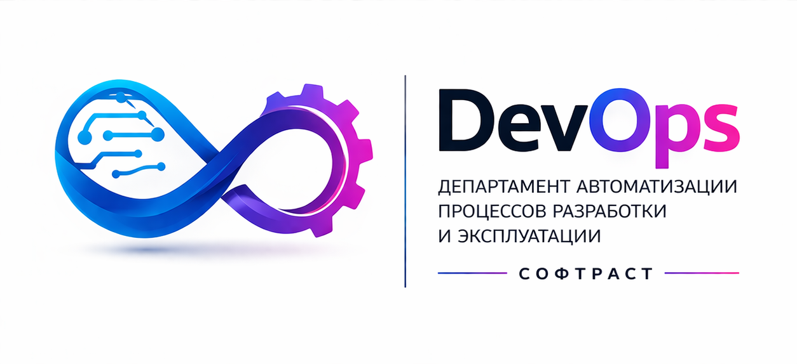

# Harbor Transfer Portal



[](https://github.com/askarahodov/Harbor-Transfer-Portal/actions/workflows/ci.yml)

**Harbor Transfer Portal** — локальный веб-портал для безопасной офлайн-передачи container images и Helm OCI charts между физически и сетево изолированными Harbor-контурами.

Портал используется, когда SOURCE и TARGET не имеют прямого сетевого соединения: пакет формируется на SOURCE, переносится разрешённым физическим способом и проверяется перед импортом на TARGET.

> **Статус:** функциональный объём **v1.0.0** реализован и прошёл release qualification. Production rollout требует локального change/release approval и проверки инфраструктуры конкретного контура.

## С чего начать

| Если вы… | Откройте |
|---|---|
| выполняете перенос | [Пользовательское руководство](docs/user-guide.md) |
| администрируете Portal / Harbor | [Руководство администратора](docs/admin-guide.md) |
| устанавливаете Portal в закрытом контуре | [Offline installation guide](deploy/offline/README.md) |
| устраняете проблему | [Troubleshooting](docs/troubleshooting.md) |
| разрабатываете или сопровождаете проект | [Локальная разработка Windows/Linux](docs/development.md), [карту документации](docs/README.md) и [CONTRIBUTING.md](CONTRIBUTING.md) |

Для штатного переноса оператору не нужно вручную работать с `skopeo`, `helm`, `tar`, `sha256sum` или Harbor CLI.

## Как это работает

```text
Harbor SOURCE
    ↓
Portal (SOURCE)
    ↓
подписанный Offline Bundle v1 + `.sha256` + signed handoff
    ↓
разрешённый физический носитель
    ↓
Portal (TARGET)
    ↓
проверка и импорт
    ↓
Harbor TARGET
```

Оператор выбирает точные версии image/chart на SOURCE. Для browser physical handoff он переносит комплект одной delivery: bundle, `.sha256` и подписанный `.htp-handoff.json`; на TARGET handoff проверяется до Bundle v1 preview и разрешённого импорта. Подробный сценарий описан в [пользовательском руководстве](docs/user-guide.md).

## Ключевые гарантии

- SOURCE и TARGET не требуют прямого portal-to-portal или Harbor-to-Harbor соединения.
- Полученный bundle считается недоверенным до успешной проверки на TARGET.
- Bundle v1 использует Ed25519 для подписи и SHA-256 для контроля целостности.
- Конфликт не приводит к неявной перезаписи target artifact.
- Credentials, JWT secrets и signing private keys не включаются в bundle и не должны храниться в Git.

Подробнее: [модель безопасности](docs/security.md) и [Offline Bundle v1](docs/offline-bundle-v1.md).

## Документация

| Тема | Документ |
|---|---|
| Обзор продукта | [Паспорт проекта](docs/project-passport.md) |
| Установка и эксплуатация | [Offline guide](deploy/offline/README.md), [Admin guide](docs/admin-guide.md) |
| Runtime SOURCE/TARGET и ключи | [Runtime mode](docs/runtime-mode.md), [Key management](docs/key-management.md) |
| Архитектура и разработка | [Windows/Linux development](docs/development.md), [docs/README.md](docs/README.md), [Architecture](docs/architecture.md), [CONTRIBUTING.md](CONTRIBUTING.md) |
| Тестирование и CI | [Testing](docs/testing.md) |
| Релиз | [Release notes v1.0.0](docs/release-notes-v1.0.0.md), [CHANGELOG.md](CHANGELOG.md) |

Исторический `docs/harbor-transfer-portal.md` не определяет текущее runtime, protocol или security behavior.

## Лицензия

Проект распространяется по лицензии [Apache License 2.0](LICENSE).
