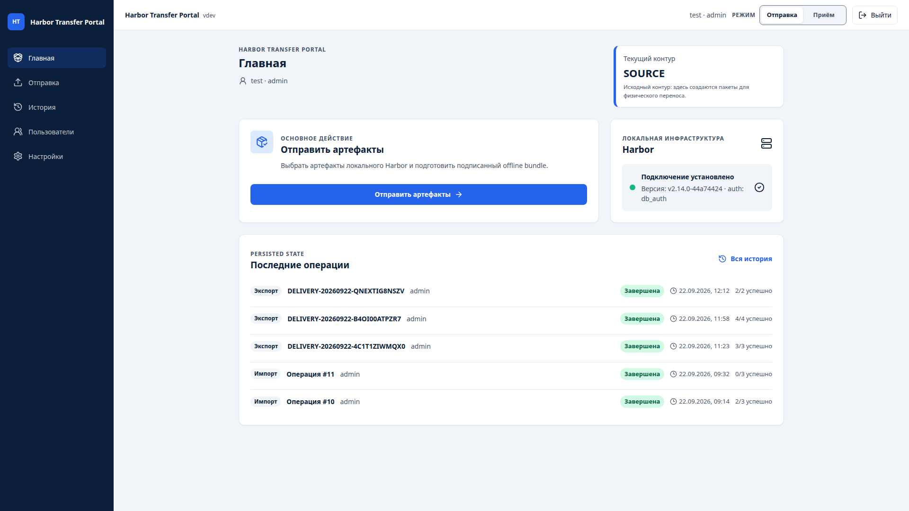

# Harbor Transfer Portal


[](https://github.com/askarahodov/Harbor-Transfer-Portal/actions/workflows/ci.yml)

**Harbor Transfer Portal** — локальный веб-портал для безопасной офлайн-передачи container images и Helm OCI charts между физически и сетево изолированными Harbor-контурами.

Портал используется, когда SOURCE и TARGET не имеют прямого сетевого соединения: пакет формируется на SOURCE, переносится разрешённым физическим способом и проверяется перед импортом на TARGET.

> **Статус:** функциональный объём **v1.0.0** реализован и прошёл release qualification. Production rollout требует локального change/release approval и проверки инфраструктуры конкретного контура.

## Интерфейс



## Быстрый старт

### Требования

- Docker Engine + Docker Compose v2 на Linux **или** Docker Desktop в режиме Linux containers на Windows 10/11;
- Git;
- доступ к разрешённым build sources для первичной source-сборки.

WSL, Git Bash, GNU Make и выполнение PowerShell scripts для обычного Docker Compose запуска на Windows не требуются. Расширенный developer workflow описан в [docs/development.md](docs/development.md).

### Windows 10/11 — CMD

В обычном `cmd.exe`:

```bat
REM 1. Клонировать и настроить
git clone https://github.com/askarahodov/Harbor-Transfer-Portal.git
cd Harbor-Transfer-Portal
copy /Y .env.example .env
REM Отредактируйте .env: PORTAL_CONTOUR, HARBOR_URL, HARBOR_USER, HARBOR_PASSWORD, JWT_SECRET

REM 2. Собрать и запустить
docker compose up -d --build --force-recreate

REM 3. Создать админа при первом запуске
set "BOOTSTRAP_ADMIN_PASSWORD=ваш-пароль-12+"
docker compose exec -T -e "BOOTSTRAP_ADMIN_PASSWORD=%BOOTSTRAP_ADMIN_PASSWORD%" backend python -m app.auth.cli --username admin
set "BOOTSTRAP_ADMIN_PASSWORD="

REM 4. Открыть Portal и документацию
start "" http://localhost:8080/
start "" http://localhost:8080/docs/
```

Если локальная политика запрещает запуск `.ps1`, ничего обходить не требуется: команды выше используют только CMD и Docker Compose.

### Linux

```bash
# 1. Клонировать и настроить
git clone https://github.com/askarahodov/Harbor-Transfer-Portal.git
cd Harbor-Transfer-Portal
cp .env.example .env
# Отредактируйте .env: PORTAL_CONTOUR, HARBOR_URL, HARBOR_USER, HARBOR_PASSWORD, JWT_SECRET

# 2. Собрать и запустить
docker compose up -d --build --force-recreate

# 3. Создать админа при первом запуске
export BOOTSTRAP_ADMIN_PASSWORD="ваш-пароль-12+"
docker compose exec -T -e BOOTSTRAP_ADMIN_PASSWORD="$BOOTSTRAP_ADMIN_PASSWORD" backend python -m app.auth.cli --username admin
unset BOOTSTRAP_ADMIN_PASSWORD

# 4. Portal:        http://localhost:8080/
#    Документация: http://localhost:8080/docs/
```

### Обязательные переменные в `.env`

| Переменная | Описание | Пример |
|---|---|---|
| `PORTAL_CONTOUR` | initial runtime role: `SOURCE` или `TARGET` | `SOURCE` |
| `HARBOR_URL` | URL legacy/default локального Harbor | `https://harbor.local` |
| `HARBOR_USER` | Service account legacy/default Harbor | `transfer-bot` |
| `HARBOR_PASSWORD` | Пароль legacy/default Harbor | `secret` |
| `JWT_SECRET` | Случайный секрет ≥32 символа | `openssl rand -base64 48` |

После bootstrap дополнительные именованные Harbor profiles управляются через **Настройки → Harbor profiles**. Новый Export/Import workflow выбирает нужный enabled profile явно; legacy/default Harbor сохраняется для backward compatibility.

### Полезные команды

```text
docker compose ps
docker compose logs -f
docker compose down
docker compose down -v
docker compose restart
docker compose up -d --build --force-recreate
```

`docker compose down -v` удаляет persistent volume и предназначен только для осознанного сброса локальных данных.

### Доступ

- **Web UI:** `http://localhost:8080/`
- **Встроенная документация Docsify:** `http://localhost:8080/docs/`
- **Health:** `http://localhost:8080/api/health`

Стандартный Compose публикует на host только frontend. Backend FastAPI остаётся внутри Compose network, поэтому его встроенный Swagger/OpenAPI UI не является отдельным host endpoint. Путь `/docs/` на опубликованном frontend принадлежит Docsify.

### Встроенная документация

После запуска полная документация доступна через встроенный Docsify на том же host/port:
`http://127.0.0.1:8080/docs/` при стандартном `PORTAL_HTTP_PORT=8080`.

Docsify JS/CSS включены во frontend image, поэтому для чтения документации в закрытом контуре не требуется Internet/CDN.

| Если вы… | Откройте |
|---|---|
| выполняете перенос | [Пользовательское руководство](docs/user-guide.md) |
| администрируете Portal / Harbor | [Руководство администратора](docs/admin-guide.md) |
| устанавливаете Portal в закрытом контуре | [Offline installation guide](deploy/offline/README.md) |
| устраняете проблему | [Troubleshooting](docs/troubleshooting.md) |
| разрабатываете или сопровождаете проект | [Локальная разработка Windows/Linux](docs/development.md), [карта документации](docs/README.md), [CONTRIBUTING.md](CONTRIBUTING.md) |

## Как это работает

```text
Harbor SOURCE
    ↓
Portal (SOURCE)
    ↓
подписанный Offline Bundle v1 + `.sha256` + signed handoff
    ↓
разрешённый физический носитель
    ↓
Portal (TARGET)
    ↓
проверка и импорт
    ↓
Harbor TARGET
```

Оператор сначала выбирает SOURCE Harbor profile и точные версии image/chart. Для browser physical handoff переносится комплект одной delivery: bundle, `.sha256` и подписанный `.htp-handoff.json`. На TARGET оператор выбирает TARGET Harbor profile, а handoff проверяется до Bundle v1 preview и разрешённого импорта. Подробный сценарий описан в [пользовательском руководстве](docs/user-guide.md).

## Ключевые гарантии

- SOURCE и TARGET не требуют прямого portal-to-portal или Harbor-to-Harbor соединения.
- Полученный bundle считается недоверенным до успешной проверки на TARGET.
- Bundle v1 использует Ed25519 для подписи и SHA-256 для контроля целостности.
- Signed handoff дополнительно связывает физически перенесённые bundle/sidecar с SOURCE identity.
- Конфликт не приводит к неявной перезаписи target artifact.
- Credentials, JWT secrets и signing private keys не включаются в bundle/handoff и не должны храниться в Git.
- Уже созданная transfer operation привязана к immutable Harbor profile snapshot и не «переезжает» на другой registry при изменении Settings.

Подробнее: [модель безопасности](docs/security.md), [Harbor profiles](docs/harbor-profiles.md), [Physical handoff](docs/physical-handoff.md) и [Offline Bundle v1](docs/offline-bundle-v1.md).

## Документация

| Тема | Документ |
|---|---|
| Обзор продукта | [Паспорт проекта](docs/project-passport.md) |
| Пользовательский transfer flow | [User guide](docs/user-guide.md) |
| Установка и эксплуатация | [Offline guide](deploy/offline/README.md), [Admin guide](docs/admin-guide.md) |
| Harbor profiles | [Harbor profiles](docs/harbor-profiles.md), [Settings](docs/settings.md) |
| Runtime SOURCE/TARGET и ключи | [Runtime mode](docs/runtime-mode.md), [Key management](docs/key-management.md) |
| Архитектура и разработка | [Windows/Linux development](docs/development.md), [карта документации](docs/README.md), [Architecture](docs/architecture.md), [CONTRIBUTING.md](CONTRIBUTING.md) |
| Тестирование и CI | [Testing](docs/testing.md) |
| Релиз | [Release notes v1.0.0](docs/release-notes-v1.0.0.md), [CHANGELOG.md](CHANGELOG.md) |

Исторический `docs/harbor-transfer-portal.md` не определяет текущее runtime, protocol или security behavior.

## Лицензия

Проект распространяется по лицензии [Apache License 2.0](LICENSE).
