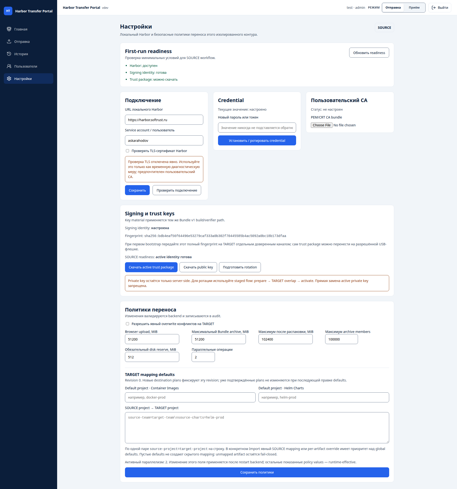

# Руководство администратора Harbor Transfer Portal

**Статус:** актуальная эксплуатационная инструкция baseline **v1.0.0** для универсального runtime `SOURCE`/`TARGET`, включая shipped offline installation kit.

Этот документ описывает администрирование одной установки Harbor Transfer Portal: offline install, runtime role, local Harbor, users/RBAC, credentials/CA, signing/trust keys, transfer policies, persistent data и lifecycle. Пошаговый operator flow SOURCE → physical transfer → TARGET описан в [user-guide.md](user-guide.md). Полный contract переключения роли — [runtime-mode.md](runtime-mode.md). Нормативный переносимый формат задаёт [Offline Bundle Protocol v1](offline-bundle-v1.md), security model — [security.md](security.md).

Фактическая структура экрана **Настройки** — Harbor profiles, readiness, default Harbor, credential/CA, keys, transfer policies, retention и TARGET mapping defaults — описана отдельно в [settings.md](settings.md).



## 1. Один deployment, runtime role SOURCE/TARGET

Один и тот же Harbor Transfer Portal deployment поддерживает обе runtime-роли:

- `SOURCE` — export workspace и SOURCE signing semantics;
- `TARGET` — import workspace и TARGET trust semantics.

Role **не выбирает удалённый Harbor**. Одна installation знает только настроенный локальный Harbor, не хранит credentials противоположного Harbor и не создаёт сетевой путь между физически изолированными контурами. В реальном air-gap процессе на разных площадках обычно остаются отдельные installations, но software/deployment больше не фиксируется навсегда как SOURCE или TARGET.

`PORTAL_CONTOUR` — только bootstrap default новой базы:

```text
PORTAL_CONTOUR=SOURCE
```

или:

```text
PORTAL_CONTOUR=TARGET
```

При первом startup backend сохраняет authoritative runtime mode и monotonic revision в SQLite. После этого restart, upgrade или изменение `PORTAL_CONTOUR` не должны переопределять сохранённый mode. Operator/Admin переключает SOURCE ↔ TARGET через UI без rebuild/restart; viewer видит role read-only. Незавершённые mode-bound operations блокируют unsafe switch.

Подробный lifecycle, race/recovery и backup/restore semantics: [runtime-mode.md](runtime-mode.md).

## 2. Production/offline installation v1.0.0

Versioned release archive строится в контролируемой release environment из заранее собранных images:

```bash
./deploy/build-release-images.sh 1.0.0
./deploy/build-offline-kit.sh 1.0.0
```

В закрытый контур передаются:

```text
harbor-transfer-portal-v1.0.0-offline-install.tar.gz
harbor-transfer-portal-v1.0.0-offline-install.tar.gz.sha256
```

После проверки внешнего checksum и распаковки задайте **начальный** bootstrap mode новой установки, например:

```bash
PORTAL_CONTOUR=SOURCE ./install.sh
```

или:

```bash
PORTAL_CONTOUR=TARGET ./install.sh
```

Это не создаёт разные SOURCE/TARGET builds. Один и тот же kit используется в обеих ролях. После первого успешного startup переключайте role через UI; не редактируйте `PORTAL_CONTOUR` как штатный способ runtime switch.

Installer проверяет internal checksums, Docker Engine/Compose, architecture и disk capacity, выполняет `docker load`, проверяет exact local image identity и запускает Compose только с bundled images (`--no-build --pull never`). `.env` создаётся локально, JWT secret генерируется на площадке; существующий regular `.env` не перезаписывается молча.

Release kit **не содержит** Harbor credentials, JWT secret, SOURCE private key, TARGET trust material, SQLite DB, receipts/history или backup archives.

Полная installation/lifecycle процедура: [deploy/offline/README.md](../deploy/offline/README.md).

## 3. Предварительные требования площадки

Нужны:

- Docker Engine;
- Docker Compose v2;
- поддерживаемая architecture release image (`amd64`/`arm64` согласно конкретному kit);
- достаточный disk capacity;
- local Harbor текущей установки;
- отдельный Harbor service account;
- для SOURCE role — Ed25519 signing private key;
- для TARGET role — trusted SOURCE public key(s);
- утверждённый physical transfer process/media.

В universal installation обе категории key material могут физически присутствовать в persistent storage, но backend никогда не смешивает их semantics: SOURCE signing использует только private signing key, TARGET verification — только explicit trusted public keys. Подробнее: [universal-mode-key-isolation.md](universal-mode-key-isolation.md).

Runtime закрытого контура не должен зависеть от internet/CDN. Не выполняйте `docker compose build`, `npm install`, `pip install` или image pull как часть штатной offline установки.

## 4. Первый запуск, browser HTTPS и bootstrap admin

После `install.sh` raw frontend HTTP listener по умолчанию доступен только на loopback:

```text
PORTAL_HTTP_BIND=127.0.0.1
PORTAL_HTTP_PORT=8080
PORTAL_BROWSER_SCHEME=http
```

`http://127.0.0.1:8080` предназначен для bootstrap/diagnostics и как upstream локального TLS terminator. **Authenticated remote browser use должен идти через HTTPS.**

Поддерживаемая production topology:

```text
Browser --HTTPS--> site-managed TLS terminator --HTTP--> 127.0.0.1:8080 --> Portal
```

TLS certificate/private key остаются инфраструктурой площадки и не входят в release kit. После настройки TLS terminator задайте в `.env`:

```text
PORTAL_BROWSER_SCHEME=https
```

и перезапустите Compose. Backend использует эту trusted deployment-настройку для security-sensitive browser attributes; пользовательский `X-Forwarded-Proto` не является trust source.

Если approved TLS terminator находится на отдельном хосте, задайте `PORTAL_HTTP_BIND` адресом выделенного внутреннего интерфейса Portal и ограничьте firewall доступом только с terminator. Не публикуйте raw HTTP listener на всю сеть без такого ограничения. Backend `:8000` штатным Compose вообще не публикуется на host.

Полная схема и проверка: [browser-transport.md](browser-transport.md).

Проверки runtime:

```text
GET /api/health
GET /api/ready
GET /healthz
```

Backend entrypoint применяет Alembic migrations до запуска API.

Создайте первый local admin, передавая password только как временную environment variable процесса:

```bash
export BOOTSTRAP_ADMIN_PASSWORD='replace-with-a-strong-password'
docker compose --env-file .env -f compose.yaml exec -T \
  -e BOOTSTRAP_ADMIN_PASSWORD="$BOOTSTRAP_ADMIN_PASSWORD" \
  backend python -m app.auth.cli --username admin
unset BOOTSTRAP_ADMIN_PASSWORD
```

После этого входите через web UI по настроенному HTTPS endpoint. Local HTTP используйте только как явный bootstrap/diagnostic mode.

## 5. Local users и RBAC

Роли:

| Роль | Возможности |
|---|---|
| `admin` | settings, users, policies, signing/trust keys, административные операции |
| `operator` | SOURCE export, TARGET intake/import, разрешённые operation actions |
| `viewer` | read-only dashboard/history/reports |

Admin UI **«Пользователи»** позволяет создавать local users, менять role/status/password. Security-sensitive mutation требует подтверждения. Password/hash не возвращаются API/UI.

Backend защищает от удаления последнего active admin через role/status change. Hard-delete пользователей не используется, чтобы сохранять audit identity history.

Подробности: [admin-user-management.md](admin-user-management.md).

## 6. Настройка local Harbor

Используйте отдельный service account минимально необходимых прав:

- SOURCE — read/pull metadata/artifacts разрешённых projects;
- TARGET — read + push/write разрешённых target projects/repositories.

Не выдавайте global Harbor admin только ради удобства.

Через admin **«Настройки локального Harbor»** можно хранить несколько именованных Harbor profiles. Для каждого profile задаются URL, username/service account, отдельный managed credential, TLS verification, optional custom CA и connection test.

Для **новых browser transfer workflows** installation-wide active selector не является
registry authority. Operator/admin явно выбирает enabled Harbor profile непосредственно в
SOURCE **Отправка** до browse/preview/export или в TARGET **Приём** до
upload/discovery/preview/import. Frontend передаёт `profile_id` явно, а backend при
создании operation фиксирует immutable snapshot `harbor_profile_id/name/url`. После этого
selector становится read-only, а worker использует operation-bound profile; изменение
browser preference или legacy fallback не может перенаправить уже созданную operation.

Installation-wide selector в Settings сохранён как **Legacy fallback Harbor** только для
старых API callers/automation, которые не передают explicit `profile_id`, и для legacy
operations без profile snapshot. Переключение fallback не блокируется новыми pinned
operations; оно блокируется только незавершёнными legacy operations, которые действительно
зависят от global fallback. Profile, являющийся текущим fallback, нельзя disable или
удалить — сначала выберите другой enabled fallback.

Mutation safety относится к самому operation-bound profile: пока существует связанная с
ним non-terminal operation, backend блокирует изменение URL/username/TLS/credential/CA и
enabled state, способное изменить execution identity/trust context. Profile, на который
ссылается persisted operation evidence, нельзя удалить. Это ограничение действует
независимо от того, является ли profile legacy fallback.

Существующая single-Harbor конфигурация из `.env`/legacy Settings представлена как
защищённый **Default Harbor** profile. Это сохраняет backward compatibility. Legacy
`GET/PATCH /api/settings/harbor`, credential/CA endpoints и их connection test относятся
именно к Default Harbor. Новый browse/export/import использует Default только когда он
явно выбран в workflow; legacy caller без `profile_id` использует Legacy fallback.

`HARBOR_URL` задаёт bootstrap/default profile и должен указывать на Harbor origin без embedded credentials, query/fragment или произвольного subpath. Дополнительные profiles хранят non-secret metadata в SQLite, а credentials/CA — отдельными files в persistent secret area; secret values API/UI не возвращают.

## 7. Harbor credential

Предпочтительный persistent path:

```text
HARBOR_MANAGED_SECRET_FILE=./data/secrets/harbor-password
```

Credential, установленный через UI, сохраняется server-side с restrictive permissions и не возвращается обратно.

Fallback order:

1. managed credential file;
2. `HARBOR_PASSWORD_FILE`;
3. `HARBOR_PASSWORD` environment.

`HARBOR_PASSWORD` оставлен для bootstrap compatibility и не является рекомендуемым постоянным storage.

Rotation:

1. создайте новый credential в local Harbor;
2. сохраните его в Portal Settings;
3. выполните connection test;
4. после успеха отзовите старый credential.

Audit фиксирует action/field metadata без secret value.

## 8. TLS и private CA

Штатно:

```text
HARBOR_VERIFY_TLS=true
```

При private PKI:

1. оставьте verification включённой;
2. загрузите PEM/CRT CA через admin Settings;
3. выполните connection test;
4. убедитесь, что соединение успешно без insecure fallback.

Managed CA:

```text
HARBOR_MANAGED_CA_FILE=./data/secrets/harbor-ca.pem
```

`HARBOR_VERIFY_TLS=false` не является штатным исправлением x509/private-CA ошибки. Harbor TLS и Browser ↔ Portal HTTPS — независимые trust boundaries; `PORTAL_BROWSER_SCHEME` не изменяет Harbor verification.

## 9. SOURCE signing key

SOURCE создаёт Bundle v1 и хранит Ed25519 private key только локально.

Для новой установки рекомендуемый путь — **Settings → Signing и trust keys → Создать signing identity**. Backend сам генерирует Ed25519 private key, сохраняет его server-side с restrictive permissions и показывает только public fingerprint.

После этого admin скачивает **SOURCE trust package** (`.htp-trust.tar.gz`). В нём только public material: public PEM, identity metadata и fingerprint. Private key туда не входит.

Trust package можно перенести в TARGET на разрешённой USB-флешке/съёмном
носителе. Для первого bootstrap полный `sha256:...` fingerprint SOURCE
передайте **отдельным доверенным каналом** и сверьте в TARGET UI. Не считайте
файл fingerprint, лежащий на той же флешке, независимым доказательством
происхождения ключа.

Ручная генерация через OpenSSL остаётся advanced-вариантом для controlled rotation/import существующей identity:

```bash
umask 077
openssl genpkey -algorithm ED25519 -out source-signing-private.pem
openssl pkey -in source-signing-private.pem -pubout -out source-signing-public.pem
```

UI показывает status/fingerprint, но не возвращает private key после сохранения. Backend валидирует Ed25519, нормализует key и хранит его с restrictive permissions.

Private key нельзя передавать:

- в Offline Bundle;
- на TARGET;
- в release kit;
- в Git/logs/issues/chats;
- как постоянный command-line argument.

Rotation выполняется только staged-flow: **Подготовить rotation → перенести pending trust package → TARGET проверяет package подписью уже trusted old SOURCE key → убедиться, что old+new enabled → Активировать pending key**. Pending package содержит public identity и Ed25519 endorsement от текущего active SOURCE key; private key не переносится. Прямая замена уже настроенного active private key запрещена.

## 10. TARGET trusted SOURCE keys

TARGET хранит только public keys:

```text
BUNDLE_TRUSTED_PUBLIC_KEYS_DIR=./data/keys/trusted-source
```

Для первичной настройки admin выбирает **Импортировать SOURCE trust package**,
вводит полный expected SOURCE fingerprint, полученный отдельно от USB/media, и
подтверждает enrollment. TARGET проверяет allowlist archive, Ed25519 public key,
metadata и exact expected fingerprint до изменения trust set. Без expected
fingerprint fresh TARGET первый trust не создаёт.

При плановой rotation expected fingerprint вручную не требуется: pending package
подписан текущим SOURCE active key, а TARGET проверяет endorsement против уже
enabled trusted public key. Unknown/disabled endorser или invalid signature
отклоняются. Повторный импорт уже известной identity идемпотентен.

Через UI также можно вручную добавить/заменить, enable/disable и удалить Ed25519 public key по fingerprint. Private/malformed/oversized material отклоняется.

Trust package/public key должен поступать по утверждённому организационному каналу. Перед disable/remove старого key Portal показывает impact: historical imports, enabled-key count и READY/in-flight operations. Retirement блокируется, пока незавершённые imports зависят от этого fingerprint.

Подробнее: [key-management.md](key-management.md).

## 11. Transfer policies и limits

Admin Settings поддерживает runtime policies, включая:

- `import_allow_overwrite` — default `false`;
- upload/archive/extracted size limits;
- member/path/metadata limits;
- disk reserve;
- operation concurrency.

Включение `import_allow_overwrite` не делает overwrite автоматическим: operator/admin всё равно подтверждает конкретные `CONFLICT` items. `UNKNOWN/ERROR` остаются блокирующими.

Не увеличивайте limits только чтобы принять неожиданно большой или malformed bundle. Оцените реальный payload, temporary workspace, extracted copy, concurrency и disk reserve.

Подробнее: [transfer-policies.md](transfer-policies.md).

## 12. Persistent data

Release Compose использует stable named volume `harbor-transfer-portal_portal-data`, монтируемый в `/app/data`.

Основные данные:

```text
/app/data/
├── harbor-transfer-portal.db
├── packages/
├── incoming/
├── outgoing/
├── logs/
├── receipts/
├── secrets/
├── keys/
└── tmp/
```

Backend работает под UID/GID `10001`. Не используйте `docker compose down -v` как обычный restart: `-v` удаляет persistent volume.

### Retention transfer payloads

Physical transfer payloads имеют bounded lifecycle:

- completed SOURCE publication по умолчанию хранится 7 суток;
- successful TARGET import удаляет staging bundle сразу после `COMPLETED`;
- failed/partial TARGET bundle по умолчанию хранится 7 суток, чтобы deterministic retry мог использовать тот же payload;
- import extraction workspace удаляется после worker;
- cleanup по умолчанию запускается каждый час.

Эти три retention значения admin меняет в **Настройки → Политики переноса → Очистка transfer storage**.
UI хранит override в SQLite и применяет его без restart backend. `EXPORT_BUNDLE_RETENTION_SECONDS=604800`,
`IMPORT_BUNDLE_RETENTION_SECONDS=604800` и `STORAGE_CLEANUP_INTERVAL_SECONDS=3600` остаются только
bootstrap/default значениями `.env`, пока admin не сохранил override.

History, receipt, checksum/size metadata и audit events после physical cleanup сохраняются. Не заменяйте эту policy ручным удалением произвольных каталогов внутри `/app/data`.

Подробнее: [storage-retention.md](storage-retention.md).

## 13. Backup

Для offline installation используйте shipped:

```bash
./backup.sh
```

Backup включает `.env` и persistent `/app/data`, следовательно содержит:

- SQLite/history/audit state, включая authoritative runtime mode и `runtime.portal_mode_version`;
- Harbor managed secret/CA;
- SOURCE private key и/или TARGET trust set, если они настроены на universal instance;
- receipts и другую retained metadata.

Такой archive является sensitive secret backup. Храните его отдельно от release kit и публичного trust material.

Script создаёт internal/external checksums и использует локальный backend image без network pull.

## 14. Restore

Restore выполняется matching-version kit и требует explicit confirmation:

```bash
./restore.sh /secure/backups/harbor-transfer-portal-backup-v1.0.0-....tar.gz --confirm-restore
```

До destructive mutation script проверяет external/internal checksums, allowlist backup members, product/version/bootstrap-contour metadata/volume identity и unsafe archive paths/types.

После восстановления SQLite authoritative runtime mode и revision берутся из restored persistent state. Значение `PORTAL_CONTOUR` в восстановленном `.env` остаётся bootstrap fallback и не должно переключать уже инициализированный runtime state. После restore проверьте `GET /api/runtime` или mode indicator в UI.

Restore не является автоматическим Alembic downgrade. Для recovery сначала восстановите matching version, подтвердите health и runtime mode, затем выполняйте штатный upgrade.

## 15. Upgrade

Распакуйте новый kit отдельно и выполните из него:

```bash
./upgrade.sh /path/to/previous-install
```

Upgrade сначала создаёт обязательный pre-upgrade backup, затем загружает bundled images, переносит прежний `.env`, меняя только `PORTAL_VERSION`, и запускает `--no-build --pull never --wait`.

При startup failure configuration возвращается к предыдущей версии, но уже применённая DB migration может требовать restore pre-upgrade backup. Автоматический database rollback не обещается. Persistent runtime mode переживает штатный upgrade; installation без runtime metadata bootstrap-ит его один раз из `PORTAL_CONTOUR` при первом startup новой версии.

## 16. Uninstall

Безопасный uninstall:

```bash
./uninstall.sh
```

останавливает workload, но сохраняет `.env` и persistent volume.

Destructive data purge требует явного подтверждения:

```bash
PORTAL_CONFIRM_PURGE=DELETE_PORTAL_DATA ./uninstall.sh --purge-data
```

Даже purge не удаляет `.env` и release files автоматически.

## 17. SOURCE → TARGET штатный workflow

После admin configuration operator работает через browser. На universal instance текущая role выбирается runtime switcher; при физически раздельных контурах каждая installation всё равно взаимодействует только со своим local Harbor.

Для первого обмена admin сначала выполняет trust bootstrap: SOURCE создаёт signing identity и скачивает `.htp-trust.tar.gz`; package переносится на разрешённом USB/media, а полный SHA-256 fingerprint SOURCE передаётся TARGET отдельным доверенным каналом. TARGET admin вводит expected fingerprint и импортирует identity только при exact match. First-run readiness в Settings показывает Harbor + identity/trust state.

После bootstrap штатный operator flow:

1. в `SOURCE` role `/export`: выбирает точные image/chart versions из local Harbor;
2. проверяет preview/digests;
3. запускает export и ждёт `COMPLETED`;
4. скачивает `.htp.tar.gz` и `.sha256`;
5. физически переносит файлы по утверждённой процедуре;
6. переключает принимающий Portal в `TARGET` role (если это universal single-instance scenario) и открывает `/import`;
7. TARGET выполняет upload archive или discovery готовой archive+sidecar пары;
8. TARGET проверяет archive/schema/signature/checksums до mutation;
9. перед mutation повторно проверяются signer trust, destination-plan integrity и final TARGET state;
10. operator анализирует `NEW/SAME/CONFLICT/UNKNOWN/ERROR` и запускает допустимый import;
11. проверяет receipt/history/CSV/PDF reports.

`SAME` — idempotent skip. `CONFLICT` блокируется по умолчанию. `UNKNOWN/ERROR` не трактуются как `NEW`.

Подробности: [user-guide.md](user-guide.md) и [runtime-mode.md](runtime-mode.md).

## 18. Restart и interrupted operations

Resume середины Skopeo/Helm subprocess после restart baseline v1 не поддерживает. Active interrupted operations reconciles в safe terminal state; SOURCE cleanup не должен оставлять ready-looking partial publication. TARGET `READY` может сохраняться, пока mutation не началась.

Выбранный runtime mode и monotonic revision сохраняются в SQLite и переживают restart. Не определяйте operation state по text logs — источник истины persisted DB state/API.

## 19. Release identity v1.0.0

Оператор видит version в UI; `/api/health` возвращает ту же runtime version. SOURCE Bundle записывает `source.portal_version`.

Release tooling fail-closed проверяет согласованность archive metadata и OCI labels. Stale image от другого commit/revision не должен упаковываться как текущий release.

Release notes: [release-notes-v1.0.0.md](release-notes-v1.0.0.md). Changelog: [CHANGELOG.md](../CHANGELOG.md).

## 20. Release qualification

Release-critical behavior автоматически проверяется CI:

- backend/frontend checks;
- protocol/security gates по scope;
- real Skopeo/Helm local-registry integration;
- Compose smoke;
- clean-host offline install одного archive с predictable bootstrap role;
- runtime migration/restart/backup-restore SOURCE↔TARGET lifecycle;
- isolated SOURCE → physical bundle → TARGET flow с separate registries;
- digest/Helm verification, receipt/history/report;
- replay skip, conflict default-deny, tamper rejection;
- documentation links и общий `quality-gate`.

Эти проверки являются частью текущего v1 release process, а не будущей работой.

## 21. Diagnostics

Начинайте с:

```bash
docker compose --env-file .env -f compose.yaml ps
docker compose --env-file .env -f compose.yaml logs backend
docker compose --env-file .env -f compose.yaml logs frontend
```

Проверяйте health/readiness, `/api/runtime`, local Harbor connection test, key status и operation error code. Не публикуйте raw secret-bearing logs.

Пошаговые сценарии: [troubleshooting.md](troubleshooting.md).

## 22. Что остаётся внешним операционным контролем

Portal не заменяет:

- host/OS hardening;
- site TLS certificate/private-key lifecycle и network policy вокруг Browser ↔ Portal boundary;
- Harbor account governance;
- physical media custody/malware controls;
- backup retention/escrow;
- организационный release/change approval.

Эти controls должны быть определены площадкой поверх application fail-closed boundaries.
