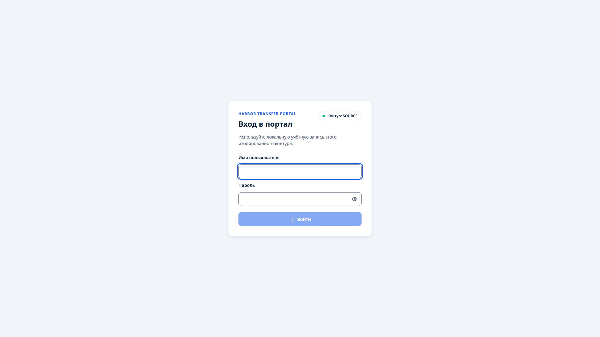
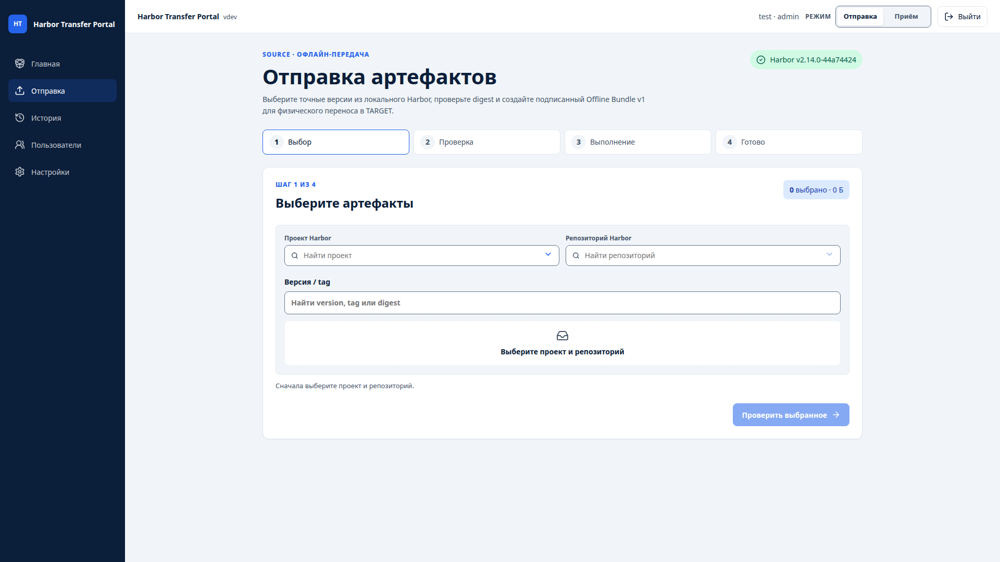
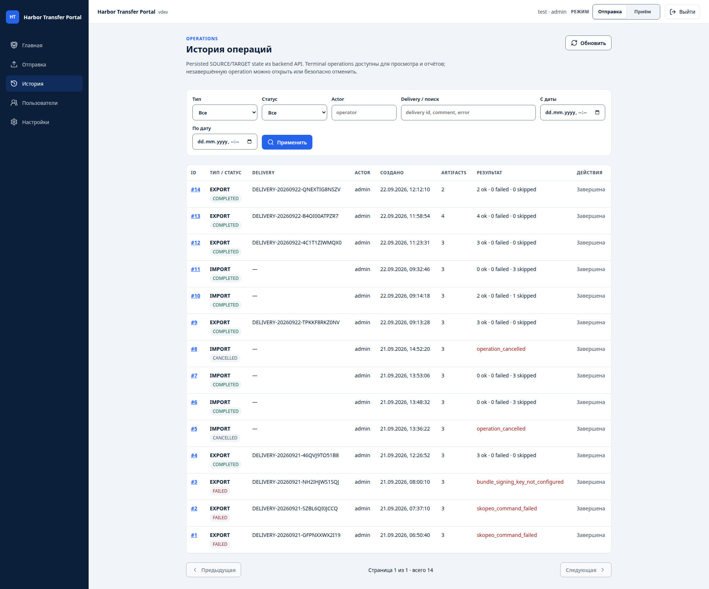

# Пользовательское руководство Harbor Transfer Portal

**Статус:** актуальное руководство для текущего v1 UI в runtime-ролях SOURCE и TARGET.

Это руководство предназначено для ролей `operator` и `viewer`. Оно описывает фактически реализованный путь через браузер: выбрать артефакты в SOURCE role, получить offline bundle, физически перенести его в принимающий контур, проверить preview в TARGET role, выполнить импорт и прочитать результат в истории.

Административная настройка Harbor, пользователей, TLS/CA и ключей описана отдельно в [admin-guide.md](admin-guide.md). Переключение универсального runtime SOURCE/TARGET — в [runtime-mode.md](runtime-mode.md). Технический формат переносимого пакета определяет [Offline Bundle Protocol v1](offline-bundle-v1.md).

## 1. Что важно понимать до начала

Harbor Transfer Portal использует **один universal software/deployment**, который в каждый момент работает в одной runtime-роли:

- **SOURCE** знает только настроенный local Harbor и создаёт подписанный offline bundle;
- **TARGET** знает только тот же настроенный local Harbor этой installation, проверяет полученный bundle и импортирует его;
- переключение SOURCE/TARGET меняет рабочую роль Portal, но **не выбирает другой Harbor** и не меняет credentials;
- в реальном air-gap процессе физически раздельные контуры обычно имеют собственные Portal installations, потому что прямого сетевого пути SOURCE → TARGET нет;
- перенос между контурами выполняется физически по принятой в организации процедуре;
- Harbor replication между контурами не используется.

Operator/Admin может переключить runtime role через UI, если нет блокирующей незавершённой операции. Viewer видит mode read-only. Никогда не пытайтесь «ускорить» перенос, настраивая credentials чужого физического Harbor или создавая сетевой путь между изолированными контурами.

## 2. Роли пользователя

| Возможность | `operator` | `viewer` |
|---|---:|---:|
| Войти и видеть текущий runtime mode | да | да |
| Переключать SOURCE ↔ TARGET | да | нет |
| Смотреть Dashboard и History | да | да |
| Запускать SOURCE export | да | нет |
| Запускать TARGET import | да | нет |
| Скачать CSV/PDF отчёт terminal operation | да | да |
| Скачать canonical TARGET receipt своей import operation | да | нет |
| Изменять пользователей/настройки | нет | нет |

`viewer` работает в режиме только для чтения. Если необходимо выполнить перенос, нужен `operator` или `admin`.

## 3. Вход и проверка текущего режима :id=login



1. Откройте URL Portal в браузере.
2. Войдите под выданной учётной записью.
3. На странице **«Главная»** найдите карточку **«Текущий контур»** / runtime mode.
4. Перед операцией убедитесь, что она показывает ожидаемое значение:
   - `SOURCE` — здесь создаётся пакет;
   - `TARGET` — здесь пакет проверяется и импортируется.
5. Если вы `operator`/`admin` и нужна другая role, используйте runtime switcher в UI. Не редактируйте `.env` и не перезапускайте Docker ради обычного переключения.
6. Проверьте карточку локального Harbor. Для transfer workflow Harbor должен быть доступен.

Если switch заблокирован из-за незавершённой export/import operation, сначала дождитесь её terminal state либо завершите её штатным способом. Не пытайтесь обходить `runtime_mode_busy` рестартом или прямым изменением SQLite.

Если Portal не может подтвердить runtime mode, на Dashboard появляется предупреждение. **Не запускайте перенос**, пока администратор не восстановит корректное persistent state.

Frontend дополнительно скрывает неподходящие действия, но mode и роль пользователя повторно проверяются backend. Нельзя использовать `/export` как TARGET или `/import` как SOURCE обходом адресной строки.


## 4. Полный путь SOURCE → физический перенос → TARGET

Нормальный пользовательский сценарий выглядит так:

```text
Portal в SOURCE role
  → выбрать точные image/chart versions
  → проверить preview
  → создать подписанный .htp.tar.gz
  → скачать archive + .sha256 + signed .htp-handoff.json
  → физически перенести все три файла
Portal в принимающем контуре, TARGET role
  → принять archive
  → проверить schema/signature/checksums
  → увидеть NEW/SAME/CONFLICT/UNKNOWN/ERROR
  → подтвердить допустимое действие
  → импортировать
  → проверить результат / receipt / History / reports
```

В тестовой/универсальной single-instance схеме один и тот же Portal может последовательно пройти SOURCE → TARGET → SOURCE без restart. В production air-gap на разных физических площадках это не отменяет необходимость физической передачи файлов и отсутствия сетевого пути между Harbors.

Ни `skopeo`, ни `helm`, ни `tar`, ни `sha256sum` пользователю для штатного переноса не нужны.

---

# Часть A. SOURCE — создание offline bundle

## 5. Откройте workflow отправки :id=source-export



В SOURCE mode на Dashboard для `operator` доступно основное действие **«Отправить артефакты»**. Оно ведёт на `/export`.

Wizard состоит из четырёх этапов:

1. **Выбор**;
2. **Проверка**;
3. **Выполнение**;
4. **Готово**.

Если вместо wizard отображается сообщение «Экспорт доступен только в контуре SOURCE», текущий runtime mode — TARGET. Переключите role через UI только если нет незавершённой блокирующей операции.

## 6. Шаг 1 — выберите Harbor и точные артефакты

Выбор выполняется только из Harbor profile, доступного текущей SOURCE installation.

Последовательно:

1. выберите **SOURCE Harbor profile**. Portal показывает только enabled profiles без credential/CA content;
2. после выбора profile найдите Harbor project;
3. выберите repository — этот уровень становится доступен только после project;
4. ниже используйте широкий поиск **Version / tag** по tag/version/digest;
5. в таблице результатов проверьте reference, тип, digest, размер и время публикации;
6. отметьте checkbox у одного или нескольких нужных rows и нажмите **«Добавить выбранное»**;
7. повторите поиск/страницы при необходимости; уже добавленные artifacts остаются в отдельном списке выбранного и могут быть удалены до preview.

При смене project/repository зависимый version list сбрасывается, чтобы устаревшая версия не попала в операцию. Поиск и pagination выполняются через Harbor backend, а не локальной фильтрацией текущей страницы. Если несколько выбранных aliases указывают на один immutable digest, transfer selection остаётся idempotent и не создаёт второй transfer item.

Portal не предлагает unsupported OCI artifact как поддерживаемый export v1 и показывает его только диагностически. Для container image без tag selector использует digest как точную reference; это позволяет сохранить проверяемую immutable identity.

Для переноса важна именно **точная версия**, а не только имя repository. Digest используется как ожидаемая идентичность содержимого.

## 7. Шаг 2 — проверьте preview

Перед запуском export Portal повторно валидирует выбор через backend и локальный Harbor.

Проверьте:

- тип каждого артефакта;
- repository/name;
- tag или chart version;
- digest;
- количество выбранных элементов;
- комментарий SOURCE, если он используется в вашем процессе.

Если Harbor сообщает, что выбранная версия исчезла или digest изменился, не продолжайте со старым preview. Обновите выбор.

## 8. Шаг 3 — дождитесь завершения операции

После запуска создаётся persisted export operation. UI показывает её фазу и прогресс; состояние не выводится из текстовых container logs.

Типичный успешный путь:

```text
CREATED → VALIDATING → RUNNING → PACKAGING → VERIFYING → COMPLETED
```

Возможные terminal states:

- `COMPLETED` — пакет успешно создан и проверен;
- `FAILED` — операция завершилась ошибкой;
- `CANCELLED` — операция была отменена.

Не считайте bundle готовым только потому, что промежуточный archive появился на диске. Пользовательский download предлагается после успешной publication boundary.

## 9. Шаг 4 — скачайте комплект физической поставки

После `COMPLETED` для физического переноса используются:

- **bundle** — archive вида `*.htp.tar.gz`;
- **whole-file checksum** — `*.htp.tar.gz.sha256`;
- **signed handoff** — `*.htp-handoff.json`.

Перед физическим переносом убедитесь, что:

- скачаны **все три** файла одной delivery;
- их Delivery ID совпадает;
- archive не был переименован отдельно от sidecar/handoff;
- файлы не редактировались вручную.

Signed handoff связывает фактический archive и sidecar с SOURCE identity и проверяется TARGET до Bundle v1 preview.

## 10. Физический перенос

Скопируйте комплект одной delivery на разрешённый физический носитель по вашей организационной процедуре:

```text
<delivery>.htp.tar.gz
<delivery>.htp.tar.gz.sha256
<delivery>.htp-handoff.json
```

Правила:

- не изменяйте содержимое archive;
- не пересчитывайте и не «исправляйте» sidecar/handoff вручную;
- не добавляйте в bundle пароли, токены или private keys;
- не распаковывайте недоверенный archive вручную на TARGET;
- доставьте носитель в TARGET по утверждённой процедуре контроля физического переноса.

`.sha256` проверяет целостность целого archive, но **не является доказательством происхождения**. Authenticity подписанного manifest подтверждается Ed25519 signature на TARGET.

---

# Часть B. TARGET — приём, preview и импорт

## 11. Откройте workflow приёма :id=target-import

В TARGET mode на Dashboard для `operator` доступно основное действие **«Принять пакет»**. Оно ведёт на `/import`.

Wizard состоит из трёх этапов:

1. **Приём и проверка**;
2. **Preview и конфликты**;
3. **Импорт и результат**.

Если отображается сообщение «Import workflow доступен только в контуре TARGET», текущий runtime mode — SOURCE. Переключите role через UI только после завершения блокирующих SOURCE operations.


## 12. Шаг 1 — выберите TARGET Harbor и передайте пакет Portal

Сначала выберите **TARGET Harbor profile**, в который должна быть направлена эта import
operation. Profile фиксируется backend уже на intake/discovery boundary; после создания
operation selector становится read-only. Reload страницы восстанавливает profile из
persisted operation snapshot, поэтому import не переедет на другой Harbor из-за изменения
browser preference или legacy fallback в Settings.

Есть два поддерживаемых пользовательских варианта.

### Вариант A — физическая поставка через браузер

Это основной операторский путь. Перенесите в TARGET-контур **три файла одной delivery**:

- `<delivery>.htp.tar.gz`;
- `<delivery>.htp.tar.gz.sha256`;
- `<delivery>.htp-handoff.json`.

В `/import` выберите или перетащите все три файла одновременно. Portal проверит, что имена относятся к одному Delivery ID, затем передаст большой archive как raw stream и привяжет к нему signed handoff и checksum sidecar.

Оператору не нужны `docker cp`, доступ к filesystem контейнера, CLI или ручная распаковка.

### Вариант B — большой пакет / transfer media

Для большого bundle используется configured incoming directory или смонтированный transfer media.

1. Скопируйте туда **готовый комплект одной delivery**:
   - `.htp.tar.gz`;
   - соответствующий `.sha256`;
   - signed `.htp-handoff.json`.
2. Откройте `/import`.
3. Нажмите **«Обнаружить готовые пакеты»**.
4. Выберите появившуюся import operation.

Portal claim-ит только допустимые готовые delivery triplets. Если sidecar или signed handoff отсутствует либо копирование ещё не завершено, такой package не должен считаться ready delivery.

## 13. Что именно проверяет TARGET до импорта

TARGET сначала проверяет bundle и только потом разрешает Harbor mutation.

В UI отдельно отображаются результаты:

- **SHA-256 integrity** — целостность принятого содержимого;
- **Bundle v1 schema/canonical manifest** — совместимость структуры/manifest;
- **Ed25519 signature trust** — manifest подписан ключом SOURCE, которому TARGET доверяет.

Это независимые проверки. В частности:

- checksum отвечает на вопрос «данные изменились?»;
- signature отвечает на вопрос «подписан ли manifest доверенным SOURCE?».

Зелёный checksum **не заменяет** trusted signature.

Если verification завершилась `REJECTED`, Harbor mutation не должна начинаться.

## 14. Шаг 2 — прочитайте preview

После успешной криптографической проверки Portal инспектирует локальный TARGET Harbor и классифицирует каждый артефакт.

| Состояние | Значение | Обычное действие |
|---|---|---|
| `NEW` | такого target artifact ещё нет | импортировать |
| `SAME` | target уже содержит тот же digest/version | безопасно пропустить |
| `CONFLICT` | то же имя/tag/version существует с другим digest | заблокировать по умолчанию |
| `UNKNOWN` | TARGET state нельзя надёжно доказать | не импортировать |
| `ERROR` | проверка TARGET завершилась ошибкой | не импортировать |

### Куда будут импортированы артефакты

Сначала выберите TARGET projects по типу:

- **Container images → TARGET project**;
- **Helm charts → TARGET project**.

Для обычной поставки этого достаточно. Portal сохраняет имя repository/chart и tag/version, меняя только project назначения. До обращения к Harbor экран сразу показывает ожидаемый маршрут **SOURCE → TARGET**.

Кнопка **«Проверить TARGET»** ничего не импортирует. Она только подтверждает:

- существует ли TARGET project;
- разрешена ли запись;
- существует ли уже итоговая reference;
- является ли она `NEW`, `SAME`, `CONFLICT`, `UNKNOWN` или `ERROR`.

Расширенные правила по умолчанию свёрнуты:

- правило **SOURCE project → TARGET project** нужно, если целый исходный project должен идти не в общий project по типу;
- индивидуальное исключение нужно, если только один конкретный artifact должен попасть в другой project;
- приоритет: индивидуальное исключение → правило SOURCE project → project по умолчанию.

Если назначение изменено после проверки, Import блокируется до повторного **«Проверить TARGET»**. Это не означает изменение Harbor — новая настройка только ещё раз проходит read-only validation.

Перед нажатием import проверьте:

- SOURCE delivery metadata;
- комментарий SOURCE, если есть;
- итоговые TARGET references;
- ожидаемые digests;
- классификацию каждого image/chart;
- список конфликтов;
- отсутствие `UNKNOWN` и `ERROR`.

## 15. Как понимать конфликты

### `SAME`

`SAME` — не ошибка. Portal видит тот же ожидаемый artifact и при обычном сценарии пропускает его как idempotent success.

### `CONFLICT`

`CONFLICT` означает, что в TARGET уже есть та же logical reference, но содержимое отличается.

Безопасный default:

> не перезаписывать.

Если server-side policy не разрешает overwrite, UI сообщает, что конфликт надо разрешить отдельно.

Если overwrite явно разрешён политикой, UI показывает отдельное подтверждение **только для перечисленных CONFLICT artifacts**. Даже в этом режиме:

- `SAME` остаётся skip;
- `UNKNOWN` и `ERROR` продолжают блокировать import.

Не просите администратора включить overwrite только ради того, чтобы «убрать красный статус». Сначала выясните, почему TARGET содержит другой digest.

## 16. Шаг 3 — запустите import

При безопасном preview основное действие называется:

**«Импортировать NEW · пропустить SAME»**.

Если разрешён и явно подтверждён конфликтный overwrite, появляется отдельное опасное действие **«Импортировать с подтверждённым overwrite»**.

Во время выполнения операция проходит persisted states, например:

```text
READY → IMPORTING → VERIFYING_TARGET → COMPLETED
```

Успешный push сам по себе ещё не означает success: после импорта Portal независимо проверяет результат в TARGET Harbor.

Terminal states import operation:

- `COMPLETED` — import завершён и результат сохранён;
- `FAILED` — выполнение началось, но один из этапов завершился ошибкой;
- `REJECTED` — bundle не прошёл pre-import verification;
- `CANCELLED` — операция отменена.

Partial execution failure не означает автоматический rollback уже импортированных artifacts. Всегда смотрите per-artifact result.

## 17. Receipt после импорта

После завершения TARGET import UI показывает immutable receipt и предлагает **«Скачать receipt JSON»** для владельца операции (`operator`) или администратора.

Receipt содержит machine-readable итог операции и может быть перенесён обратно в SOURCE по организационной процедуре, если вашему процессу это требуется.

`viewer` canonical receipt не скачивает через import-domain endpoint.

---

# Часть C. История, отчёты и чтение результата



## 18. History

Страница `/history` доступна `viewer`, `operator` и `admin`.

History использует persisted backend state, а не raw container logs. Можно фильтровать операции по типу, статусу, actor, строке поиска и диапазону дат.

Для новых операций History также показывает immutable Harbor profile evidence: display name и URL snapshot, закреплённые при создании операции. Это позволяет проверить, к какому registry фактически относился transfer, даже если административный fallback profile позже изменился.

Открыв operation detail, проверьте:

- operation id;
- тип `EXPORT`/`IMPORT`;
- persisted status;
- actor;
- delivery id;
- время начала/завершения;
- bundle metadata;
- per-artifact status;
- SOURCE/TARGET digest;
- safe error code/message.

Terminal History остаётся историческим/read-only: завершённую operation нельзя изменить или
«перезапустить» как новую mutation. Для **незавершённой** operation History предоставляет
ограниченные lifecycle-действия по существующему backend contract: владелец-`operator` или
`admin` может открыть/продолжить тот же workflow либо запросить штатную отмену. `viewer`
остаётся полностью read-only. Эти действия не меняют transfer policy и не создают
дубликат operation.

## 19. CSV и PDF отчёты

Для terminal operation (`COMPLETED`, `FAILED`, `REJECTED`, `CANCELLED`) в History доступны:

- **«Скачать CSV»**;
- **«Скачать PDF»**.

Эти отчёты доступны и `operator`, и `viewer` с тем же read-access, что и operation detail.

CSV удобен для дальнейшего машинного анализа; PDF — для человекочитаемого отчёта. Оба формируются из persisted operation/artifact state, а не из container logs.

Если операция ещё выполняется, отчёт не считается готовым.

## 20. Canonical receipt в History

Для TARGET import canonical receipt остаётся отдельным от CSV/PDF report.

- `operator` видит download receipt для своей import operation;
- `admin` может читать receipt любой import operation;
- `viewer` receipt action не получает, но продолжает видеть read-only History и CSV/PDF reports.

---

# Часть D. Что делать при ошибках

## 21. Простая схема действий

Если workflow показывает ошибку:

1. зафиксируйте **operation id**;
2. запишите **safe error code**, показанный UI;
3. запишите phase/status и artifact reference без credentials;
4. не меняйте bundle/manifest/checksum вручную;
5. откройте [troubleshooting.md](troubleshooting.md) и найдите соответствующий симптом/code;
6. если проблема требует конфигурации Harbor/TLS/key/policy — передайте её администратору.

Не отправляйте в тикеты/чаты:

- Harbor password/token;
- bearer token/JWT;
- SOURCE private signing key;
- полный `.env`;
- непроверенные raw logs с чувствительными данными.

## 22. Частые пользовательские ситуации

### Harbor недоступен

Если Dashboard показывает, что local Harbor недоступен, transfer лучше не запускать. Повторите проверку позже или сообщите администратору.

### `harbor_auth_failed` / `harbor_forbidden`

Portal не может использовать local Harbor account либо ему недостаточно прав. Не пытайтесь вводить Harbor credentials в URL или расширять права самостоятельно — это задача администратора.

### TLS/x509 ошибка

Не отключайте TLS verification как workaround. Администратор должен исправить CA/certificate configuration.

### `bundle_sidecar_checksum_mismatch`

Archive и `.sha256` не совпадают. Не редактируйте sidecar. Повторно перенесите полный delivery triplet из исходного SOURCE output.

### `bundle_signature_invalid` / `bundle_signature_untrusted`

Происхождение manifest не подтверждено доверенным TARGET key set. Bundle надо отклонить до выяснения причины. Не добавляйте неизвестный public key только ради успешной проверки.

### `bundle_schema_unsupported` / `bundle_schema_invalid`

SOURCE/TARGET несовместимы по protocol либо bundle повреждён. Не редактируйте `schema_version` вручную.

### `CONFLICT`

Не overwrite-ите автоматически. Сравните ожидаемый и TARGET digest и выясните, почему reference уже занята другим содержимым.

### `UNKNOWN` / `ERROR` в preview

Import должен оставаться заблокированным. Сначала восстановите возможность доказать состояние TARGET Harbor.

### Недостаточно места / слишком большой browser upload

Если пакет превышает configured browser upload policy или носитель смонтирован непосредственно на TARGET server, используйте incoming/transfer-media flow с archive + `.sha256` + signed `.htp-handoff.json` и действие **«Обнаружить готовые пакеты»**.

### Operation прервалась после restart

Portal не обещает прозрачное продолжение середины Skopeo/Helm команды. Смотрите final persisted status в History и только после этого решайте, нужен ли новый transfer.

### Runtime switch заблокирован

Если UI сообщает `runtime_mode_busy`, существует незавершённая mode-bound operation. Не обходите блокировку. Дождитесь terminal state/штатной отмены, обновите runtime state и повторите switch.

Полный список диагностических сценариев: [troubleshooting.md](troubleshooting.md).

---

# Часть E. Практические правила безопасности

## 23. Не делайте этого

- не создавайте сетевой путь SOURCE ↔ TARGET ради Portal;
- не используйте Harbor replication между изолированными контурами;
- не переносите SOURCE private signing key в другой физический TARGET-контур;
- не переносите TARGET Harbor credentials в SOURCE-контур;
- не используйте runtime switch как способ выбрать credentials удалённого Harbor;
- не распаковывайте непроверенный bundle вручную;
- не пересчитывайте checksum после изменения package;
- не редактируйте подписанный manifest;
- не отключайте TLS verification «на время» без отдельного осознанного admin решения;
- не overwrite-ите `CONFLICT` только ради завершения операции;
- не трактуйте checksum как доказательство authenticity.

## 24. Что можно безопасно передавать между контурами

В рамках штатного transfer workflow переносится delivery output:

- `.htp.tar.gz`;
- соответствующий `.sha256`;
- signed `.htp-handoff.json`;
- при отдельной организационной процедуре — публичный trust material или receipt, если это требуется эксплуатации.

В bundle не должны попадать Harbor credentials, JWT secret или private signing key.

---

# Часть F. Границы текущей версии

## 25. Что уже реализовано

Текущий browser flow поддерживает:

- login и role-aware UI;
- authoritative runtime SOURCE/TARGET mode и live switcher для operator/admin;
- SOURCE Harbor browse и 4-step export wizard;
- подписанный Offline Bundle v1;
- archive + `.sha256` + signed handoff download;
- TARGET browser intake полного физического triplet (bundle + `.sha256` + signed handoff) и incoming discovery;
- schema/signature/checksum verification до Harbor mutation;
- NEW/SAME/CONFLICT/UNKNOWN/ERROR preview;
- safe default no-overwrite;
- import progress и independent target verification;
- immutable receipt;
- persisted History;
- CSV/PDF operation reports.

## 26. Что не следует считать завершённым только по этому guide

Этот guide описывает уже существующий application flow, но **не является доказательством финального release acceptance**.

Release/acceptance gates отдельно подтверждают offline installation, runtime lifecycle и isolated-style SOURCE → physical copy → TARGET E2E. Не выдавайте наличие работающих wizard за единственное доказательство production readiness.

## 27. Связанные документы

- [Карта документации](README.md)
- [Runtime SOURCE/TARGET mode](runtime-mode.md)
- [Архитектура](architecture.md)
- [Frontend/current UI](frontend.md)
- [SOURCE export orchestration](export-orchestration.md)
- [TARGET import orchestration](import-orchestration.md)
- [Offline Bundle Protocol v1](offline-bundle-v1.md)
- [History UI](history-ui.md)
- [Отчёты и receipts](reports-receipts.md)
- [Troubleshooting](troubleshooting.md)
- [Security model](security.md)
- [Admin guide](admin-guide.md)
